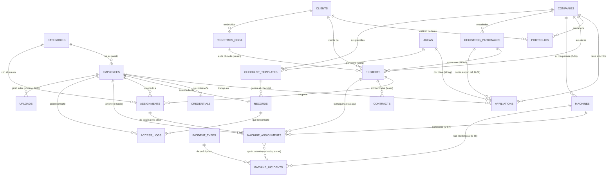

# Arquitectura de datos y relaciones

**Qué es esto:** el mapa de lo que existe **hoy** en la base — qué colecciones
hay, cómo se relacionan y qué se rompe si tocas cada una. Se lee antes de
cambiar cualquier esquema.

**Cómo se relaciona con los otros documentos:**

| Documento            | Qué manda                                                       |
| -------------------- | --------------------------------------------------------------- |
| **Este**             | **Lo que HAY**: colecciones, relaciones e impacto de cambiarlas |
| `modelo-datos.md`    | El diseño y su porqué. Ha derivado; donde discrepe, manda éste  |
| `backend-spec.md`    | El contrato HTTP: envelope, códigos, enums y catálogo de rutas  |
| `DECISIONES.md`      | Por qué cada cosa es como es (D-01 … D-91)                      |
| `CONTRATO-API.md`    | La forma de las respuestas HTTP, petición por petición          |
| `ARQUITECTURA.md`    | Las capas del código (modelo → servicio → controlador → ruta)   |
| `ESTADO.md`          | Qué está hecho y qué falta                                      |
| `HANDOFF-BACKEND.md` | La conversación con el front                                    |

> **Mantener esto al día es parte de cambiar el esquema, no un extra.** Si
> agregas o quitas una colección, un campo que relacione datos, un índice único o
> una invariante, actualiza este archivo **en el mismo cambio**. Un mapa
> desactualizado es peor que no tenerlo.

---

## 1. Panorama: 19 colecciones en tres grupos

Lo primero que hay que entender es que **no todas son iguales**. Se comportan
distinto y se rompen distinto.

### Catálogos — independientes, sin dueño

Existen por sí solos. Nadie los "posee" y casi todo lo demás los apunta. Se dan
de baja, **nunca se borran**.

| Colección        | Qué es                                   | Único por                   | Baja                                              |
| ---------------- | ---------------------------------------- | --------------------------- | ------------------------------------------------- |
| `companies`      | Las empresas del grupo                   | nombre, RFC                 | `activo: false`                                   |
| `clients`        | Clientes del grupo                       | nombre, RFC                 | `activo: false`                                   |
| `categories`     | Puestos                                  | nombre normalizado          | `activo: false`, bloqueada si en uso              |
| `areas`          | Áreas de la organización                 | `clave`, nombre normalizado | `activa: false`, bloqueada si en uso              |
| `incident_types` | Tipos de incidencia de maquinaria (D-88) | nombre normalizado          | `activo: false`, **permitida aunque esté en uso** |

**Dentro de dos de ellos viven subdocumentos con identidad propia** (D-65, D-66),
y esto importa más de lo que parece:

| Subdocumento                      | Dentro de   | Único por               | Lo referencia                 |
| --------------------------------- | ----------- | ----------------------- | ----------------------------- |
| `companies.registrosPatronales[]` | `companies` | `numero`, en su empresa | `projects.registroPatronalId` |
| `clients.registrosObra[]`         | `clients`   | `numero`, en su cliente | `projects.registroObraId`     |

Desde **D-79**, el registro de obra lleva además su papel escaneado en
`clients.registrosObra[].archivo` (`models/attachmentSchema.js`): opcional, uno
solo y **sin versiones** —reemplazarlo borra el anterior de R2—. Su
`claveAlmacenamiento` **no** va `select: false`, al revés que en el expediente
(D-41): el cliente se guarda entero cada vez que se toca uno de sus registros, y
un campo no cargado se escribiría vacío. Lo que impide que se filtre es el
`toJSON`, que nunca la incluye.

No son colecciones porque no tienen vida fuera de su padre: un registro patronal
sin empresa no significa nada. Pero **sí tienen `_id`**, porque hay que apuntarles
— y un `ObjectId` es único globalmente, así que basta para identificarlo sin
ambigüedad. La alternativa que se descartó era guardarlos como cadenas: corregir
un dígito habría roto en silencio cada proyecto que lo apuntaba.

Los cinco catálogos son **globales**, no por empresa. La razón es siempre la misma: el
empleado es global y puede estar en dos empresas, así que un catálogo por empresa
lo dejaría con un puesto o un área ambiguos (D-32). `incident_types` es global por
una razón distinta pero del mismo orden: una «falla hidráulica» es la misma en
todas las empresas, y partir la lista impediría sumar los reportes (D-88).

`incident_types` es además el único catálogo cuya **baja no se bloquea si está en
uso**: dar de baja un tipo no deja a nadie con un dato inválido —la incidencia
vieja lo conserva y lo sigue mostrando—, y bloquearla obligaría a arrastrar para
siempre un tipo mal capturado.

### Entidades y vínculos — el núcleo

| Colección             | Qué es                                              | Depende de                            |
| --------------------- | --------------------------------------------------- | ------------------------------------- |
| `employees`           | **La persona.** El centro de todo                   | `categories`                          |
| `credentials`         | La contraseña, aislada (D-27)                       | `employees` (1 a 1)                   |
| `affiliations`        | **La relación laboral** empresa ↔ persona           | `companies`, `employees`, `areas`     |
| `portfolios`          | Qué clientes usa cada empresa                       | `companies`, `clients`                |
| `projects`            | Obras y proyectos                                   | `companies`, `clients`                |
| `assignments`         | Quién está en qué proyecto                          | `projects`, `employees`, `categories` |
| `contracts`           | **El contrato/fase** de una obra, con su SIROC      | `projects`                            |
| `machines`            | **La maquinaria** de cada empresa (D-86)            | `companies`                           |
| `machine_assignments` | **Dónde está cada máquina y quién la tiene** (D-87) | `machines`, `projects`, `employees`   |
| `machine_incidents`   | Las **incidencias** de una máquina (D-88)           | `machines`, `incident_types`          |
| `checklist_templates` | Qué documentos exige cada perfil                    | `companies` (o global), `areas`       |
| `uploads`             | **Permiso de subida directa**, efímero (D-83)       | `employees` (quien lo pidió)          |
| `records`             | **El expediente.** Uno por persona                  | `employees`, `checklist_templates`    |
| `access_logs`         | Bitácora legal de accesos a documentos              | `employees`, `records`                |

### Lo que NO es una colección

Esto es lo que más confunde: **hay cosas que parecen tablas y no lo son.** Se
calculan al leer, en cada petición.

| Concepto                                               | Dónde se calcula                          | Por qué no se guarda                                                                                                              |
| ------------------------------------------------------ | ----------------------------------------- | --------------------------------------------------------------------------------------------------------------------------------- |
| **Alertas**                                            | `utils/domain/alerts.js` (D-47)           | Se resuelven solas: un documento que se renueva deja de alertar sin que nadie marque nada                                         |
| **Estatus de un documento**                            | `utils/domain/documentStatus.js`          | `vencido` depende de la fecha de hoy, no de un campo                                                                              |
| **Avance del expediente**                              | `utils/domain/progress.js`                | Se deriva de los documentos; guardarlo se desincroniza                                                                            |
| **El checklist**                                       | `utils/domain/checklist.js`               | Es la **unión** de las plantillas de sus adscripciones                                                                            |
| **El alcance del usuario**                             | `middlewares/scopeMiddleware.js`          | Se deriva de sus adscripciones activas. **No es un campo** (D-31)                                                                 |
| **Días con una máquina**                               | `utils/domain/machineTime.js` (D-87)      | El tramo vigente cuenta hasta hoy: guardarlo obligaría a recalcularlo cada día                                                    |
| **De quién era la máquina cuando pasó una incidencia** | `utils/domain/machineIncidents.js` (D-88) | Sale de cruzar la fecha con los tramos: guardarlo sería teclear dos veces lo mismo y mentiría en cuanto se corrigiera la historia |
| **Dónde está una máquina**                             | Su tramo vigente (D-87)                   | La máquina no guarda `empleadoId` ni `proyectoId`: se resuelve al leer                                                            |

> Regla del proyecto: **nada derivado se guarda en la base.** Si un dato se puede
> calcular a partir de otros, se calcula al leer.

---

## 2. El diagrama



**Leer el diagrama:** `||` es uno, `o{` es varios, `o|` es cero o uno.

`REGISTROS_PATRONALES` y `REGISTROS_OBRA` **no son colecciones**: son los arreglos
embebidos de la sección anterior, dibujados aparte porque el proyecto —y, desde
D-72, también la adscripción— les apuntan.

Las líneas de `AREAS` y las de los registros son distintas de todas las demás y
están explicadas en la sección 4: **Mongoose no las resuelve sola**.

La línea punteada entre `MACHINE_ASSIGNMENTS` y `MACHINE_INCIDENTS` es de otra
naturaleza todavía: **no hay ninguna referencia guardada entre las dos**. La
incidencia sólo sabe de qué máquina es y qué día pasó; el tramo que la cubría se
busca al leer, cruzando esa fecha (D-88).

---

## 3. Colección por colección

### `employees` — la persona

El centro. Todo cuelga de aquí. **No lleva `empresaId`**: dónde trabaja está en
`affiliations`.

- **Llaves únicas:** `curp`, `numeroEmpleado`, `acceso.email` — las tres
  **parciales**: sólo aplican cuando el campo es una cadena, porque `default:
null` haría chocar a todos los que no lo tienen.
- **`acceso`** es un subdocumento, no una colección: quien entra a la plataforma
  **es un empleado**. No hay tabla de usuarios (D-27).
- **`tipo`** (`administrativo` / `mano_de_obra`) se **deriva de `categoriaId`**
  (D-59); no se captura. Decide **quién puede gestionar a quién**.
- **Depende de:** `categories`.
- **Quién depende de ella:** todo — `affiliations`, `credentials`, `records`,
  `assignments`, `access_logs`, `projects.registradoPorId`.

### `credentials` — el secreto, aparte

Una por empleado (`empleadoId` único). Existe **sólo** para que el hash no viva
en `employees`: las agregaciones ignoran `select: false`, y el listado de
empleados es un `$lookup` sobre `employees` (D-27). **No la vuelvas a embeber**:
hay una prueba que lo impide.

### `affiliations` — la relación laboral

El vínculo empresa ↔ persona, y **la colección más cargada de reglas**.

- **Única por `(empresaId, empleadoId)`.** Si alguien vuelve a una empresa, se
  **reactiva** la que existe; no se crea otra.
- **`areas`** — dónde **trabaja**, en esa empresa.
- **`dirigeAreas`** — qué áreas **dirige** ahí (D-60). Son cosas distintas: de
  aquí sale el alcance del jefe de área, no de `areas`.
- **`nomina`** (`select: false`) — salario, SBC y cuenta bancaria, **y nada más**.
  **Ninguna respuesta los devuelve** hasta que se decida quién puede verlos
  (LFPDPPP). Hasta la limpieza de la Fase 8 cargaba además los ocho campos de
  `condiciones` duplicados, del respaldo de D-63: si ves un volcado viejo con
  `nomina.registroPatronal`, es eso y no un campo que falte hoy.
- **`payrollSnapshot`** (`select: false`) — lo que dijo el último archivo de
  nómina, para distinguir «el archivo cambió» de «lo cambiaron a mano» (D-57).
- **`registroPatronalId`** — el registro patronal de esa relación, por id contra
  el catálogo de su empresa (D-72). `null` en lo que la migración M3 no resolvió;
  el texto crudo sigue en `condiciones.registroPatronal`. Ni el importador ni la
  migración lo **pisan** si ya está: se corrige a mano y esa decisión gana.
- **Invariantes:** contrato temporal exige fecha de término; una baja exige
  motivo; `datosPendientes` relaja lo que el importador dejó sin capturar.

### `records` — el expediente

**Uno por persona** (`empleadoId` único), no uno por empresa: su INE es su INE en
las dos.

- **`documentos[]`** embebido, con **`versiones[]`** dentro. Se embebe porque
  siempre se lee y se escribe completo, y son pocas versiones.
- **`versiones[0]` es la vigente**, ordenadas de más reciente a más antigua.
- **`archivo.claveAlmacenamiento`** es `select: false`: la ubicación real en R2
  nunca se expone; para abrir un archivo se emite una URL firmada (D-41).
- **`plantillas[]`** guarda de qué plantillas salió el checklist — varias si la
  persona está en varias empresas.

### `checklist_templates` — qué documentos exige cada perfil

Se indexa por `tiposContrato` y `areas`. `empresaId: null` significa **global**.
El checklist de una persona es la **unión** de las plantillas que le aplican por
cada adscripción.

### `projects` y `assignments`

`projects` cuelga de una empresa y un cliente, y **exige que el cliente esté en
la cartera activa** de esa empresa (`portfolios`). Desde D-69 exige además dos
referencias que dicen **con qué registro patronal opera** y **cuál es su obra**:
`registroPatronalId` (de su empresa) y `registroObraId` (de su cliente). Son
obligatorias en los proyectos nuevos, **no en los que ya existían** —
`required: () => this.isNew` — porque un cambio de forma deja el sistema en dos
estados y los dos tienen que funcionar.

**El proyecto no habilita puestos** (D-82). Tuvo un `categorias[]` —el
subconjunto del catálogo con el que se podía trabajar en esa obra—, y se quitó:
sólo servía para filtrar el selector de asignables y rechazar altas, y a una obra
va quien haga falta. Quién pertenece a la empresa lo dice la **adscripción**, que
es el dato que se mantiene al día porque sale de la nómina.

`assignments` es único por `(proyectoId, empleadoId)` **sólo mientras está
activa** — índice parcial, para que alguien pueda volver al mismo proyecto
después. Conserva su propio `categoriaId`: el puesto con el que esa persona
figura **en esa obra**, que ya no se valida contra nada del proyecto y, si el
alta no lo manda, se toma del propio empleado (D-82).

### `uploads` — el permiso de subida, que dura minutos

La única colección **efímera** del modelo (D-83). Un documento nace cuando alguien
pide subir un archivo, dice a qué recurso va y qué declaró el navegador —nombre,
tipo y tamaño—, y muere cuando el adjunto queda registrado o cuando caduca sin
usarse. No es el archivo: es el permiso.

Existe por una sola razón: **un permiso tiene que valer una vez**. Con un token
firmado bastaría para autorizar, pero no para impedir que el mismo se reutilice
hasta caducar; eso exige estado. De paso deja rastro de quién pidió subir qué.

Lo que hay que saber al tocarla:

- **`estado: 'usada'` no se borra.** Es el rastro de la subida que sí llegó a su
  sitio. Lo que se limpia son los `pendiente` vencidos, con
  `npm run limpiar:subidas`.
- **`claveTemporal` apunta a `pendientes/`**, nunca a una carpeta definitiva: el
  archivo se mueve al confirmar, y sólo después de comprobar su tipo por
  contenido.
- **Nada la referencia.** Ninguna otra colección guarda un `uploadId`: cuando el
  adjunto queda registrado, lo que se guarda en el recurso es el subdocumento
  `archivo` de siempre, igual que si hubiera llegado por `multipart`.

### `machines` — la maquinaria de cada empresa

El catálogo de **maquinaria y equipo de trabajo** (D-86). A diferencia de los
cuatro catálogos de la sección 1, **es por empresa, no del grupo**: la
excavadora de Maquinaria CAMES no está en el patio de Urbanizadora, y el número
con el que cada empresa conoce a sus máquinas —económico, placa o serie— sólo
tiene sentido dentro de ella. Por eso `empresaId` es obligatorio y el alcance
es el de la empresa: fuera de él, la máquina no existe (404).

Tres datos y nada más, a propósito: `identificador`, `modelo` e `imagen`.

- **`identificador` es único dentro de la empresa**, sobre su forma normalizada
  (`identificadorNormalizado`, sin acentos ni mayúsculas, `select: false`): dos
  empresas pueden tener cada una su `ECO-12`. Chocar responde `409
MAQUINA_DUPLICADA` con la que ya está.
- **`imagen` es el `attachmentSchema`** de siempre —una sola, reemplazable, sin
  versiones (D-79)— con una restricción que los demás adjuntos no tienen: **sólo
  admite imágenes**. Un PDF ahí no es un papel raro, es un error, y responde 415. Entra por `multipart` o por subida directa (D-83, destino `maquina`).
- **`activo: false` es la baja.** Se esconde del listado salvo que se pida, no
  se borra, y **una máquina de baja no se puede asignar**. Darla de baja además
  cierra su tramo vigente (D-87): fuera de servicio no está en ninguna obra.

**Lo que NO vive aquí:** quién la tiene y en qué obra está. Eso es
`machine_assignments`, y se resuelve **al leer**: la respuesta de cualquier ruta
de máquinas trae `asignacion` —o `null` si está en el patio— sin que la máquina
guarde un solo id. Guardar aquí un `empleadoId` o un `proyectoId` sería un
derivado y se desincronizaría.

### `machine_assignments` — dónde está la máquina y quién la tiene

Un **tramo**: una máquina, en una obra, con una persona, entre dos fechas (D-87).
La cadena de tramos de una máquina **es** su historia, y de ella salen los días
que la tuvo cada quien, calculados al leer.

Lo que hay que entender antes de tocarla:

- **La obra y el trabajador viven en el mismo documento, y `empleadoId` es
  anulable.** `empleadoId: null` no es un hueco: es el estado «en la obra, sin
  trabajador», y es lo que permite que la máquina **pierda a la persona sin
  salirse de la obra** cuando al operador lo dan de baja o sale de la obra. Una
  excavadora no vuelve al patio porque su operador ya no esté.
- **Tres estados de una máquina, y los tres se leen de aquí:** sin tramo vigente
  = en el patio, disponible · tramo vigente con `empleadoId` = con esa persona en
  esa obra · tramo vigente sin `empleadoId` = en la obra, sin operador.
- **Índice único PARCIAL `{ maquinaId }` sobre `activo: true`**: una máquina está
  con una sola persona a la vez, impuesto por la base y no sólo por el servicio.
  Parcial —y no `unique` a secas— porque el histórico son muchos tramos cerrados
  de la misma máquina. Es el mismo patrón de `assignments`.
- **`proyectoId` nunca se captura.** Sale de la asignación del trabajador, cuyo
  id queda en `asignacionId` como trazabilidad. Si la persona está en varias
  obras, el cliente dice en cuál; si está en una, no se pregunta.
- **`empresaId` está copiado** de la máquina a propósito: el alcance de «las
  máquinas de un trabajador» —que puede estar adscrito a varias empresas— se
  decide con esto sin cruzar la máquina en cada consulta.
- **Cerrar no borra.** Un tramo cerrado lleva `fechaDevolucion` y `motivoCierre`
  (`devolucion`, `reasignacion`, `baja_de_maquina`, `salida_de_obra`,
  `baja_de_trabajador`), y el modelo se niega a guardar un tramo cerrado sin los
  dos, o uno vigente que los traiga.
- **Los días son inclusivos** y el día del cambio de manos lo cuentan los dos
  trabajadores: ese día la tuvieron ambos.

### `incident_types` y `machine_incidents` — las incidencias de la máquina

Una incidencia es una falla, un golpe o un servicio de una máquina (D-88). Son
**dos colecciones y no una** porque son dos cosas distintas: el catálogo de tipos
es del grupo y lo alimentan ellos; la incidencia es de una máquina y de un día.

`incident_types` es un catálogo como los de la sección 1 —nombre único sobre
`nombreNormalizado`, `esBase` para los sembrados, `activo: false` para la baja—
con las dos particularidades que ya se dijeron allí: **es global** y **su baja no
se bloquea aunque esté en uso**. Se siembra al arrancar
(`services/seedIncidentTypes.js`, `npm run seed:tipos-incidencia`), idempotente y
sin deshacer renombres.

`machine_incidents` guarda **cuatro datos y ninguno más**: `tipoId`,
`descripcion`, `fechaIncidencia` y —si ya se atendió— `fechaResolucion` con su
`notaResolucion`. Lo que hay que entender antes de tocarla:

- **`fechaResolucion: null` ES el estado «abierta».** No hay bandera aparte que
  pueda contradecirlo, y por eso no hay forma de que una incidencia esté cerrada
  sin fecha ni abierta con ella. El modelo se niega a guardar una nota de
  resolución sin resolución, o una resolución anterior a la incidencia.
- **El tipo se referencia, nunca se copia.** Renombrarlo corrige toda la
  historia; darlo de baja no toca lo ya capturado. Copiar el nombre habría dejado
  las dos cosas rotas a la vez.
- **Quién tenía la máquina y en qué obra NO se guarda.** Se deriva al leer
  cruzando `fechaIncidencia` con los tramos de `machine_assignments` de esa
  máquina (`utils/domain/machineIncidents.js`). Guardarlo sería teclear dos veces
  lo mismo y mentiría en cuanto alguien corrigiera la historia. El día del cambio
  de manos —que cubren dos tramos— se le atribuye a **quien la recibió**.
- **`empresaId` está copiado**, como en los tramos y por lo mismo: decide el
  alcance sin traer la máquina. Una máquina no cambia de empresa, así que no
  puede desfasarse.
- **La fecha puede ser de días atrás pero nunca del futuro**: se captura cuando
  se entera quien captura.

### `contracts` — el contrato, que es la fase, y su SIROC

Cada fase de una obra tiene exactamente un contrato, y un proyecto de una sola
fase no tiene fases: **son la misma entidad** y por eso hay una sola colección
(D-70). Lo que sí son dos son sus nombres: `nombre` es el del contrato
('Contrato 001-A') y `fase` su etiqueta de obra ('Fase 1', 'Cimentación'), los
dos opcionales y ninguno derivado del otro (D-75).

- `numero` es una **secuencia dentro del proyecto que asigna el servidor**, no un
  dato que se captura. Es el **hueco libre más bajo**: los dados de baja siguen
  ocupando el suyo —existen, y reusarlo chocaría contra el índice único—, pero el
  de un contrato **eliminado** (D-90) queda libre y el siguiente alta lo toma.
- `monto` es el total del contrato en pesos, **IVA incluido y sin desglosar**
  (D-90). Es obligatorio en el alta, pero **no lleva `required` en el esquema**:
  los contratos capturados antes de D-90 no lo tienen, y exigirlo haría fallar
  cualquier `save()` sobre ellos. `null` es «no se capturó» y **no es lo mismo que
  `0`**.
- `modificaciones` es la historia de lo repactado (D-90): cada una con sus
  `fechaInicio`, `fechaFin`, `monto`, su `fechaAcuerdo` —el día en que se firmó,
  casi nunca hoy—, un `motivo` opcional y **su propio convenio escaneado**.
  `original` guarda los términos con los que nació el contrato y es `null`
  mientras no haya ninguna. **Los campos de arriba son siempre los VIGENTES**: la
  modificación los pisa y el pasado baja a la historia, y por eso el techo del
  SIROC, el expediente y los candados del proyecto siguen leyendo `fechaFin` sin
  enterarse de que esto existe. `historia` —la línea del tiempo que sale en la
  respuesta— se **deriva al leer** y dice `modificado: false` cuando no hubo
  ninguna, para que la pantalla no lo deduzca de un arreglo vacío. Las
  modificaciones **no tienen `_id`**: se direccionan por posición, como los
  refrendos, y sólo se puede deshacer la última.
- `siroc` va **embebido** porque es 1:1 con el contrato y no tiene ciclo de vida
  propio. Nace en `null`.
- **El aviso guarda una sola fecha, la de registro** (D-76). No hay
  `vigenciaHasta`: la vigencia son dos meses contados desde el registro —o desde
  la última actualización— y se deriva al leer. Mientras existió como campo,
  quien capturaba tecleaba ahí la fecha de fin del contrato y el aviso terminaba
  contradiciendo al seguimiento. La quita `npm run migrate:siroc-vigencia`.
- **`siroc.numero` es único en TODO el sistema**, con índice parcial por
  `$type: 'string'` — no `sparse`, que haría chocar entre sí a los contratos sin
  SIROC. Repetirlo responde `409` diciendo dónde está el otro.
- `siroc.actualizaciones` es la lista de **refrendos del mismo aviso** (D-76): el
  SIROC se actualiza cada dos meses conservando su número, así que una renovación
  no es un SIROC nuevo sino una fecha más —con `nota` opcional— dentro del que ya
  hay. Es lo ÚNICO que se guarda de todo esto: cuántas faltan, cuándo vence la
  ventana vigente y si urge son `seguimientoSiroc`, derivado al leer (regla #6).
  Van en orden y ninguna puede ser anterior a `fechaRegistro`; una fecha suelta
  hacia atrás correría la ventana y el contrato callaría avisos que debe dar. Y
  ninguna puede ser **posterior a `fechaFin`**, que es el techo del cálculo
  (D-84): pasada esa fecha el contrato no acumula refrendos, y lo que le falta
  —que alguien lo cierre— se dice en `seguimientoContrato`, también derivado.
- **Cada refrendo dice cuánto y de qué bimestre** (D-91): `monto` es lo reportado
  en esos dos meses —**no el del contrato**, que es el total de la obra— y
  `bimestre` es a cuál corresponde, guardado **tal como se teclea**: `'3'`,
  `'2026-3'`, `'mayo-junio'`. Texto y no número a propósito, porque cada quien lo
  nombra distinto, así que sale siempre como cadena o `null` aunque llegue un
  número. Los dos son **opcionales**, por la misma razón que el acuse: del IMSS se
  vuelve con la fecha y el papel con la cifra llega después. `null` es «no se
  capturó» y **no es lo mismo que `0`**, que sería un bimestre reportado en ceros;
  los refrendos anteriores a D-91 salen todos en `null`, y no hay migración que
  los rellene porque no hay cifra que inventarles. **No se editan**: un reporte
  mal capturado se deshace y se vuelve a registrar, como con una fecha.
- **El aviso y cada refrendo llevan su propio archivo** (D-80): `siroc.archivo`
  es el aviso escaneado y `siroc.actualizaciones[].archivo` el acuse de esa
  renovación, los dos con el `attachmentSchema` de D-79 y los dos opcionales. Son
  dos papeles distintos a propósito: refrendar no sustituye al original, y la
  serie completa de acuses es lo que se enseña si el IMSS revisa. Corregir el
  SIROC con `PUT` **conserva los archivos**; sólo se reemplaza el del aviso si la
  petición trae uno nuevo, y entonces el anterior se borra de R2.
- **El contrato también lleva el suyo** (D-81): `archivo`, con el mismo
  `attachmentSchema`, es el contrato firmado escaneado. Es **uno y se
  reemplaza** —al revés que los del SIROC, que se suman—, y se adjunta al
  capturar o después, con `PUT /contratos/:id/archivo`: el papel llega días más
  tarde que las fechas. Antes de D-90 eso lo hacía el `PATCH`, que ya no existe.
- **Las renovaciones siguen sin `_id`**, así que su archivo se pide **por
  posición**. Dárselo obligaría a migrar las ya capturadas y Mongoose les
  inventaría uno distinto en cada lectura mientras tanto.
- `estado` (`en_curso` | `finalizado`) y `activo` **no son lo mismo**: el primero
  es un contrato que terminó bien, el segundo uno capturado por error. Van por
  rutas distintas.
- **Eliminar sí borra** (D-90), y es la única cosa de este modelo que lo hace:
  `DELETE /contratos/:id` se lleva el documento, su SIROC, sus refrendos, sus
  modificaciones y **todos sus objetos de R2**. Es para el contrato que nunca
  debió existir, y libera los dos números —el suyo y el del SIROC, que si no
  quedaba bloqueado para siempre en todo el sistema—. La **baja** (`activo`) es
  otra cosa y se queda: ésa sí es historia.

**Los contratos traban al proyecto.** En cuanto existe uno, el proyecto no cambia
de cliente ni de registro patronal; en cuanto uno tiene SIROC, tampoco de
registro de obra. La razón es que el aviso ante el IMSS ya salió con esa obra.

### `access_logs` — bitácora

**Requisito legal, no un extra**: un expediente trae CURP, NSS y examen médico.
Se escribe en cada emisión de URL firmada. **Nunca se edita ni se borra**, sólo
se agrega. Guarda el **nombre** de quien consultó, no sólo su id, para que el
registro siga siendo legible aunque la persona cambie.

---

## 4. Las relaciones que no son `ObjectId` — cuidado aquí

Casi todas las relaciones son `ObjectId` con `ref`, y Mongoose las resuelve.
**Siete no**, y son las que se rompen en silencio. Fallan por tres motivos
distintos.

**Las que apuntan por cadena**, contra la `clave` del área:

| Desde                         | Hacia         | Por    |
| ----------------------------- | ------------- | ------ |
| `affiliations.areas[]`        | `areas.clave` | cadena |
| `affiliations.dirigeAreas[]`  | `areas.clave` | cadena |
| `checklist_templates.areas[]` | `areas.clave` | cadena |

**Las que apuntan DENTRO de un arreglo embebido.** Son `ObjectId` de verdad, pero
**sin `ref`**, porque no hay colección a la que referir:

| Desde                         | Hacia                                 |
| ----------------------------- | ------------------------------------- |
| `projects.registroPatronalId` | `companies.registrosPatronales[]._id` |
| `projects.registroObraId`     | `clients.registrosObra[]._id`         |

`populate()` **no las resuelve**: hay que traer la empresa o el cliente y buscar
el subdocumento por `_id` dentro de su arreglo. Lo hace `findRegistry`, en
`utils/domain/registries.js`, y por eso los `populate` de proyectos y de
asignaciones seleccionan `'nombre registrosPatronales'` en vez de sólo el nombre.
Olvidarlo no da error: devuelve `null` y la pantalla se queda en blanco.

La tercera de esta familia se sumó en D-72:

| Desde                             | Hacia                                 |
| --------------------------------- | ------------------------------------- |
| `affiliations.registroPatronalId` | `companies.registrosPatronales[]._id` |

**Y una que apunta por TEXTO al mismo subdocumento**, la más floja de todas:

| Desde                                       | Hacia                                    |
| ------------------------------------------- | ---------------------------------------- |
| `affiliations.condiciones.registroPatronal` | `companies.registrosPatronales[].numero` |

Es la cadena libre que llegó del archivo de nómina, y **convive** con el id:
aquél es el vínculo validado, ésta el dato crudo del archivo — el mismo reparto
que entre `areas` y `departamento`. Nada garantiza que el texto exista entre los
registros de su empresa; el id sí.

Por eso la coherencia contra el proyecto **toma el número del vínculo cuando
existe** y se cae al texto cuando no (D-72), y en los dos casos compara números
normalizados —sólo letras y dígitos, en mayúsculas— y **avisa en vez de
bloquear** (D-71). Las dos rutas tienen que dar un resultado válido:
`registroPatronalId` está en nulo en todo lo que la migración M3 no resolvió.

**Por qué así:** la `clave` es el valor del contrato — es lo que el front compara
y lo que viaja en `?area=`. Guardar el `ObjectId` habría obligado a resolverlo en
cada respuesta y a que el front manejara ids en vez de valores legibles.

**Qué implica:**

- **La `clave` de un área es inmutable.** Renombrar cambia `nombre`, nunca
  `clave`: cambiarla dejaría huérfana a cada adscripción que la guarda.
- **No hay integridad referencial.** Nada impide que quede una `clave` apuntando a
  un área que no existe. Por eso `areaService.assertUsables` valida contra el
  catálogo **al guardar**, y `assertExiste` al filtrar.
- **Guardar exige área activa; filtrar no.** A un área dada de baja todavía hay
  gente asignada, y es justo a quien hay que encontrar para reasignar.

Hay una tercera relación por cadena, contra el **código** y no contra una
colección: `records.documentos[].tipo` apunta a `DOCUMENT_TYPES` en
`src/constants/`. Agregar un tipo de documento es cambiar el código, no un dato.

---

## 5. Matriz de impacto: si tocas esto, revisa aquello

| Si cambias…                                      | Revisa                                                                                                          |
| ------------------------------------------------ | --------------------------------------------------------------------------------------------------------------- |
| **`employees.categoriaId`**                      | `tipo` se deriva de ahí (D-59) → cambia **quién puede gestionar a esa persona**                                 |
| **`employees.tipo`**                             | `utils/permissions.js` (`canManageEmployeeType`), el desplegable de puestos                                     |
| **`affiliations.areas`**                         | El checklist (se resuelve por área) → puede cambiar **qué documentos se le exigen**                             |
| **`affiliations.dirigeAreas`**                   | `scopeMiddleware` → **qué gente ve un jefe de área**                                                            |
| **`affiliations.activo`**                        | El alcance del usuario, el checklist, las alertas, y si se queda sin ninguna activa, su baja del sistema (D-55) |
| **`areas` (dar de baja)**                        | Bloqueado si alguien la tiene. Al reactivar, vuelve a ofrecerse en los desplegables                             |
| **`categories.tipo`**                            | El `tipo` de todos los que tienen ese puesto                                                                    |
| **`checklist_templates`**                        | El checklist de **todos** los que caigan en esa plantilla; hay que re-sincronizar expedientes                   |
| **`companies.activo`**                           | Nadie puede importar ni adscribir a una empresa de baja                                                         |
| **Dar de baja un registro patronal o de obra**   | Bloqueado si un proyecto **en curso** lo usa. Hay que cerrarlos o cambiárselo primero                           |
| **Crear un contrato**                            | Traba el `clienteId` y el `registroPatronalId` de su proyecto (D-70)                                            |
| **Registrar un SIROC**                           | Traba además el `registroObraId`. Quitarlo lo libera                                                            |
| **Reemplazar el archivo de un registro de obra** | El anterior **se borra de R2** (D-79): no hay versiones a las que volver                                        |
| **`siroc.actualizaciones`**                      | Mueve la ventana de dos meses y con ella todo `seguimientoSiroc`: quitar una hace reaparecer el aviso (D-76)    |
| **Deshacer el último refrendo**                  | Se lleva también su monto y su bimestre (D-91): no se editan, se recaptura. Sólo se puede deshacer el último    |
| **`contracts.fechaFin`**                         | Es el techo del SIROC (D-84): moverla recalcula al leer cuántos refrendos pide, y decide `seguimientoContrato`  |
| **Quitar el SIROC o su última renovación**       | Sus archivos **se borran de R2** (D-80): el del aviso y el acuse de cada refrendo. No hay versiones             |
| **Reemplazar el archivo de un contrato**         | El anterior **se borra de R2** (D-81): uno solo, sin versiones. El tope de subida son 30 MB, salvo la nómina    |
| **Registrar una modificación de contrato**       | Pisa `fechaInicio`, `fechaFin` y `monto` (D-90): mueve el techo del SIROC y lo que ve el expediente             |
| **Eliminar un contrato**                         | Borra de verdad (D-90): documento, SIROC, refrendos, modificaciones y sus objetos de R2. Libera los dos números |
| **Reemplazar la imagen de una máquina**          | Lo mismo (D-86): la anterior se borra de R2. Y sólo entra una imagen: un PDF responde 415                       |
| **`machines.identificador`**                     | Único por empresa sobre la forma normalizada: cambiarlo puede chocar con otra máquina (409)                     |
| **Dar de baja una máquina asignada**             | Cierra su tramo vigente (D-87): sale de la obra y de las manos de quien la tenía, y queda en su historia        |
| **Cerrar la asignación de alguien a una obra**   | Sus máquinas se quedan **en la obra, sin trabajador** (D-87). No vuelven al patio solas: hay que devolverlas    |
| **Dar de baja a una persona**                    | Lo mismo con todas sus máquinas, en cualquier obra, dentro de la misma transacción de la baja                   |
| **`machine_assignments.fechaAsignacion`**        | Es de dónde salen los días de ese tramo y el acumulado del trabajador: nada de eso está guardado                |
| **Corregir la historia de una máquina**          | Cambia **de quién era cuando pasó cada incidencia** (D-88): el contexto se deriva al leer, no está guardado     |
| **Renombrar un tipo de incidencia**              | Cambia el nombre en **todas** las incidencias, viejas incluidas: lo referencian por id, no copiado              |
| **Dar de baja un tipo de incidencia**            | Deja de ofrecerse en el alta; las viejas lo conservan y salen con `tipo.activo: false`. No se bloquea la baja   |
| **`affiliations.registroPatronalId`**            | El aviso de coherencia al asignar y en el listado (D-71). Manda sobre el texto; no bloquea nada                 |
| **`affiliations.condiciones.registroPatronal`**  | Lo mismo, pero **sólo mientras no haya vínculo**: es el respaldo de las que M3 no resolvió (D-72)               |
| **`projects.registroPatronalId`**                | Lo mismo: el aviso se recalcula al leer, así que cambiarlo mueve toda la trazabilidad ya registrada             |
| **Un enum de `src/constants/`**                  | Es **contrato**: el front compara por igualdad estricta. Cambiar un valor lo rompe                              |
| **Cualquier índice único**                       | `npm run db:indices` en producción — `autoIndex` está apagado ahí                                               |

### Los tres efectos en cadena más largos

1. **Cambiar el puesto de alguien** → cambia su `tipo` → cambia quién puede
   editarlo → si pasa a administrativo, **exige que tenga área** en cada empresa.
2. **Cerrar la última adscripción activa de alguien** → se queda sin empresa →
   la importación le da **baja del sistema** (D-55) → desaparece del listado por
   defecto y su acceso se desactiva.
3. **Editar las plantillas del checklist** → cambia el checklist de todos los que
   caigan en ellas → cambia su **avance** → cambia sus **alertas**. Nada de eso
   está guardado: se recalcula solo, pero se nota de inmediato en toda la app.

---

## 6. Cómo se deriva el alcance (lo que decide qué ve cada quien)

No es un campo. Se calcula en cada petición, en `applyScope`:

```
Empleado con acceso
  └─ sus adscripciones ACTIVAS
       ├─ empresaId  → req.empresasVisibles   (qué empresas ve)
       └─ dirigeAreas → req.areasPorEmpresa   (qué áreas dirige en cada una)

Administrador de plataforma (acceso.alcanceGlobal)
  └─ req.empresasVisibles = null  → todas
```

Dos reglas que no se negocian:

- **`empresaId` nunca se lee del cuerpo ni del query para decidir alcance.** Sale
  del usuario. Si llega en la petición, sólo **acota** dentro de lo visible.
- **Fuera de alcance responde `404`, no `403`.** Un `403` confirmaría que existe.

---

## 7. La conexión a la base no sobrevive a una suspensión

Un detalle de operación que no se ve en el modelo pero rompe la app entera
(D-61): el pool de conexiones a Atlas **no sobrevive a que la máquina se
suspenda**. `suspend` restaura la VM con los sockets vivos en memoria y muertos
del otro lado; la primera consulta se cuelga y falla.

Por eso `fly.toml` usa `auto_stop_machines = 'stop'` y no `'suspend'`: el proceso
arranca limpio y reconecta. Y por eso `/ready` hace un `ping` real en vez de leer
`readyState`, que es una bandera local y seguía diciendo «conectado».

**Si algún día alguien vuelve a poner `suspend` para ahorrar arranque en frío, el
síntoma será: la plataforma tarda muchísimo tras un rato inactiva y luego cierra
la sesión.**

## 8. Al cambiar el esquema

1. **Actualiza este documento** en el mismo cambio: la tabla de la sección 1, el
   diagrama si hay relación nueva, y la matriz de impacto.
2. Registra el modelo nuevo en `src/models/index.js` (D-31) — hay una prueba que
   falla si falta.
3. Si agregas un índice, di en `DECISIONES.md` que hay que correr
   `npm run db:indices` en producción.
4. Si el cambio afecta a datos existentes, escribe un script en `scripts/` con
   `--dry-run`, idempotente, que **no borre nada** por defecto.
5. Anota el porqué en `DECISIONES.md` y la forma nueva en `CONTRATO-API.md`.
