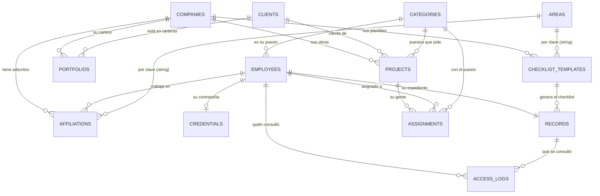

# Arquitectura de datos y relaciones

**Qué es esto:** el mapa de lo que existe **hoy** en la base — qué colecciones
hay, cómo se relacionan y qué se rompe si tocas cada una. Se lee antes de
cambiar cualquier esquema.

**Cómo se relaciona con los otros documentos:**

| Documento         | Qué manda                                                                   |
| ----------------- | --------------------------------------------------------------------------- |
| **Este**          | **Lo que HAY**: colecciones, relaciones e impacto de cambiarlas             |
| `modelo-datos.md` | El diseño **original** y su porqué. Ha derivado; donde discrepe, manda éste |
| `DECISIONES.md`   | Por qué cada cosa es como es (D-01 … D-60)                                  |
| `CONTRATO-API.md` | La forma de las respuestas HTTP                                             |
| `ARQUITECTURA.md` | Las capas del código (modelo → servicio → controlador → ruta)               |

> **Mantener esto al día es parte de cambiar el esquema, no un extra.** Si
> agregas o quitas una colección, un campo que relacione datos, un índice único o
> una invariante, actualiza este archivo **en el mismo cambio**. Un mapa
> desactualizado es peor que no tenerlo.

---

## 1. Panorama: 13 colecciones en tres grupos

Lo primero que hay que entender es que **no todas son iguales**. Se comportan
distinto y se rompen distinto.

### Catálogos — independientes, sin dueño

Existen por sí solos. Nadie los "posee" y casi todo lo demás los apunta. Se dan
de baja, **nunca se borran**.

| Colección    | Qué es                   | Único por                   | Baja                                 |
| ------------ | ------------------------ | --------------------------- | ------------------------------------ |
| `companies`  | Las empresas del grupo   | nombre, RFC                 | `activo: false`                      |
| `clients`    | Clientes del grupo       | nombre, RFC                 | `activo: false`                      |
| `categories` | Puestos                  | nombre normalizado          | `activo: false`, bloqueada si en uso |
| `areas`      | Áreas de la organización | `clave`, nombre normalizado | `activa: false`, bloqueada si en uso |

Los cuatro son **globales**, no por empresa. La razón es siempre la misma: el
empleado es global y puede estar en dos empresas, así que un catálogo por empresa
lo dejaría con un puesto o un área ambiguos (D-32).

### Entidades y vínculos — el núcleo

| Colección             | Qué es                                    | Depende de                            |
| --------------------- | ----------------------------------------- | ------------------------------------- |
| `employees`           | **La persona.** El centro de todo         | `categories`                          |
| `credentials`         | La contraseña, aislada (D-27)             | `employees` (1 a 1)                   |
| `affiliations`        | **La relación laboral** empresa ↔ persona | `companies`, `employees`, `areas`     |
| `portfolios`          | Qué clientes usa cada empresa             | `companies`, `clients`                |
| `projects`            | Obras y proyectos                         | `companies`, `clients`, `categories`  |
| `assignments`         | Quién está en qué proyecto                | `projects`, `employees`, `categories` |
| `checklist_templates` | Qué documentos exige cada perfil          | `companies` (o global), `areas`       |
| `records`             | **El expediente.** Uno por persona        | `employees`, `checklist_templates`    |
| `access_logs`         | Bitácora legal de accesos a documentos    | `employees`, `records`                |

### Lo que NO es una colección

Esto es lo que más confunde: **hay cosas que parecen tablas y no lo son.** Se
calculan al leer, en cada petición.

| Concepto                    | Dónde se calcula                 | Por qué no se guarda                                                                      |
| --------------------------- | -------------------------------- | ----------------------------------------------------------------------------------------- |
| **Alertas**                 | `utils/domain/alerts.js` (D-47)  | Se resuelven solas: un documento que se renueva deja de alertar sin que nadie marque nada |
| **Estatus de un documento** | `utils/domain/documentStatus.js` | `vencido` depende de la fecha de hoy, no de un campo                                      |
| **Avance del expediente**   | `utils/domain/progress.js`       | Se deriva de los documentos; guardarlo se desincroniza                                    |
| **El checklist**            | `utils/domain/checklist.js`      | Es la **unión** de las plantillas de sus adscripciones                                    |
| **El alcance del usuario**  | `middlewares/scopeMiddleware.js` | Se deriva de sus adscripciones activas. **No es un campo** (D-31)                         |

> Regla del proyecto: **nada derivado se guarda en la base.** Si un dato se puede
> calcular a partir de otros, se calcula al leer.

---

## 2. El diagrama



**Leer el diagrama:** `||` es uno, `o{` es varios, `o|` es cero o uno.

Las dos últimas líneas son distintas de todas las demás y están explicadas en la
sección 4: **no son `ObjectId`, son cadenas**.

---

## 3. Colección por colección

### `employees` — la persona

El centro. Todo cuelga de aquí. **No lleva `empresaId`**: dónde trabaja está en
`affiliations`.

- **Llaves únicas:** `curp`, `numeroEmpleado`, `acceso.email` — las tres
  **parciales**: sólo aplican cuando el campo es una cadena, porque `default:
null` haría chocar a todos los que no lo tienen.
- **`acceso`** es un subdocumento, no una colección: quien entra a la plataforma
  **es un empleado**. No hay tabla de usuarios (D-27).
- **`tipo`** (`administrativo` / `mano_de_obra`) se **deriva de `categoriaId`**
  (D-59); no se captura. Decide **quién puede gestionar a quién**.
- **Depende de:** `categories`.
- **Quién depende de ella:** todo — `affiliations`, `credentials`, `records`,
  `assignments`, `access_logs`, `projects.registradoPorId`.

### `credentials` — el secreto, aparte

Una por empleado (`empleadoId` único). Existe **sólo** para que el hash no viva
en `employees`: las agregaciones ignoran `select: false`, y el listado de
empleados es un `$lookup` sobre `employees` (D-27). **No la vuelvas a embeber**:
hay una prueba que lo impide.

### `affiliations` — la relación laboral

El vínculo empresa ↔ persona, y **la colección más cargada de reglas**.

- **Única por `(empresaId, empleadoId)`.** Si alguien vuelve a una empresa, se
  **reactiva** la que existe; no se crea otra.
- **`areas`** — dónde **trabaja**, en esa empresa.
- **`dirigeAreas`** — qué áreas **dirige** ahí (D-60). Son cosas distintas: de
  aquí sale el alcance del jefe de área, no de `areas`.
- **`nomina`** (`select: false`) — salario, SBC y cuenta bancaria. **Ninguna
  respuesta los devuelve** hasta que se decida quién puede verlos (LFPDPPP).
- **`payrollSnapshot`** (`select: false`) — lo que dijo el último archivo de
  nómina, para distinguir «el archivo cambió» de «lo cambiaron a mano» (D-57).
- **Invariantes:** contrato temporal exige fecha de término; una baja exige
  motivo; `datosPendientes` relaja lo que el importador dejó sin capturar.

### `records` — el expediente

**Uno por persona** (`empleadoId` único), no uno por empresa: su INE es su INE en
las dos.

- **`documentos[]`** embebido, con **`versiones[]`** dentro. Se embebe porque
  siempre se lee y se escribe completo, y son pocas versiones.
- **`versiones[0]` es la vigente**, ordenadas de más reciente a más antigua.
- **`archivo.claveAlmacenamiento`** es `select: false`: la ubicación real en R2
  nunca se expone; para abrir un archivo se emite una URL firmada (D-41).
- **`plantillas[]`** guarda de qué plantillas salió el checklist — varias si la
  persona está en varias empresas.

### `checklist_templates` — qué documentos exige cada perfil

Se indexa por `tiposContrato` y `areas`. `empresaId: null` significa **global**.
El checklist de una persona es la **unión** de las plantillas que le aplican por
cada adscripción.

### `projects` y `assignments`

`projects` cuelga de una empresa y un cliente, y **exige que el cliente esté en
la cartera activa** de esa empresa (`portfolios`). `assignments` es único por
`(proyectoId, empleadoId)` **sólo mientras está activa** — índice parcial, para
que alguien pueda volver al mismo proyecto después.

### `access_logs` — bitácora

**Requisito legal, no un extra**: un expediente trae CURP, NSS y examen médico.
Se escribe en cada emisión de URL firmada. **Nunca se edita ni se borra**, sólo
se agrega. Guarda el **nombre** de quien consultó, no sólo su id, para que el
registro siga siendo legible aunque la persona cambie.

---

## 4. Las relaciones que no son `ObjectId` — cuidado aquí

Casi todas las relaciones son `ObjectId` con `ref`, y Mongoose las resuelve. **Dos
no**, y son las que se rompen en silencio:

| Desde                         | Hacia         | Por    |
| ----------------------------- | ------------- | ------ |
| `affiliations.areas[]`        | `areas.clave` | cadena |
| `affiliations.dirigeAreas[]`  | `areas.clave` | cadena |
| `checklist_templates.areas[]` | `areas.clave` | cadena |

**Por qué así:** la `clave` es el valor del contrato — es lo que el front compara
y lo que viaja en `?area=`. Guardar el `ObjectId` habría obligado a resolverlo en
cada respuesta y a que el front manejara ids en vez de valores legibles.

**Qué implica:**

- **La `clave` de un área es inmutable.** Renombrar cambia `nombre`, nunca
  `clave`: cambiarla dejaría huérfana a cada adscripción que la guarda.
- **No hay integridad referencial.** Nada impide que quede una `clave` apuntando a
  un área que no existe. Por eso `areaService.assertUsables` valida contra el
  catálogo **al guardar**, y `assertExiste` al filtrar.
- **Guardar exige área activa; filtrar no.** A un área dada de baja todavía hay
  gente asignada, y es justo a quien hay que encontrar para reasignar.

Hay una tercera relación por cadena, contra el **código** y no contra una
colección: `records.documentos[].tipo` apunta a `DOCUMENT_TYPES` en
`src/constants/`. Agregar un tipo de documento es cambiar el código, no un dato.

---

## 5. Matriz de impacto: si tocas esto, revisa aquello

| Si cambias…                     | Revisa                                                                                                          |
| ------------------------------- | --------------------------------------------------------------------------------------------------------------- |
| **`employees.categoriaId`**     | `tipo` se deriva de ahí (D-59) → cambia **quién puede gestionar a esa persona**                                 |
| **`employees.tipo`**            | `utils/permissions.js` (`canManageEmployeeType`), el desplegable de puestos                                     |
| **`affiliations.areas`**        | El checklist (se resuelve por área) → puede cambiar **qué documentos se le exigen**                             |
| **`affiliations.dirigeAreas`**  | `scopeMiddleware` → **qué gente ve un jefe de área**                                                            |
| **`affiliations.activo`**       | El alcance del usuario, el checklist, las alertas, y si se queda sin ninguna activa, su baja del sistema (D-55) |
| **`areas` (dar de baja)**       | Bloqueado si alguien la tiene. Al reactivar, vuelve a ofrecerse en los desplegables                             |
| **`categories.tipo`**           | El `tipo` de todos los que tienen ese puesto                                                                    |
| **`checklist_templates`**       | El checklist de **todos** los que caigan en esa plantilla; hay que re-sincronizar expedientes                   |
| **`companies.activo`**          | Nadie puede importar ni adscribir a una empresa de baja                                                         |
| **Un enum de `src/constants/`** | Es **contrato**: el front compara por igualdad estricta. Cambiar un valor lo rompe                              |
| **Cualquier índice único**      | `npm run db:indices` en producción — `autoIndex` está apagado ahí                                               |

### Los tres efectos en cadena más largos

1. **Cambiar el puesto de alguien** → cambia su `tipo` → cambia quién puede
   editarlo → si pasa a administrativo, **exige que tenga área** en cada empresa.
2. **Cerrar la última adscripción activa de alguien** → se queda sin empresa →
   la importación le da **baja del sistema** (D-55) → desaparece del listado por
   defecto y su acceso se desactiva.
3. **Editar las plantillas del checklist** → cambia el checklist de todos los que
   caigan en ellas → cambia su **avance** → cambia sus **alertas**. Nada de eso
   está guardado: se recalcula solo, pero se nota de inmediato en toda la app.

---

## 6. Cómo se deriva el alcance (lo que decide qué ve cada quien)

No es un campo. Se calcula en cada petición, en `applyScope`:

```
Empleado con acceso
  └─ sus adscripciones ACTIVAS
       ├─ empresaId  → req.empresasVisibles   (qué empresas ve)
       └─ dirigeAreas → req.areasPorEmpresa   (qué áreas dirige en cada una)

Administrador de plataforma (acceso.alcanceGlobal)
  └─ req.empresasVisibles = null  → todas
```

Dos reglas que no se negocian:

- **`empresaId` nunca se lee del cuerpo ni del query para decidir alcance.** Sale
  del usuario. Si llega en la petición, sólo **acota** dentro de lo visible.
- **Fuera de alcance responde `404`, no `403`.** Un `403` confirmaría que existe.

---

## 7. Al cambiar el esquema

1. **Actualiza este documento** en el mismo cambio: la tabla de la sección 1, el
   diagrama si hay relación nueva, y la matriz de impacto.
2. Registra el modelo nuevo en `src/models/index.js` (D-31) — hay una prueba que
   falla si falta.
3. Si agregas un índice, di en `DECISIONES.md` que hay que correr
   `npm run db:indices` en producción.
4. Si el cambio afecta a datos existentes, escribe un script en `scripts/` con
   `--dry-run`, idempotente, que **no borre nada** por defecto.
5. Anota el porqué en `DECISIONES.md` y la forma nueva en `CONTRATO-API.md`.
