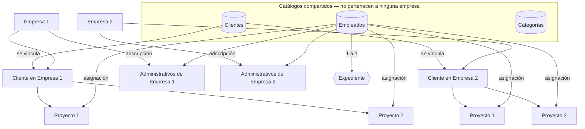

# Modelo de datos — Plataforma de Expedientes (Urbacames)

> **Este es el diseño ORIGINAL y su porqué.** El modelo ha cambiado desde
> entonces (D-27 en adelante): las áreas son un catálogo, el número de
> trabajador es de la persona, el tipo se deriva del puesto, y hay jefaturas de
> área. Para saber **qué existe hoy y cómo se relaciona**, lee
> `ARQUITECTURA-DATOS.md`; donde los dos discrepen, manda ése.

> **Documento autoritativo del modelo.** Define **qué se guarda y cómo se
> relaciona**. Su complemento es [`backend-spec.md`](./backend-spec.md), que
> define **cómo se habla** con el backend: envelope, códigos, errores y rutas.
> Los dos juntos son lo que necesita el equipo de backend.
>
> Escrito para implementarse en **MongoDB con Mongoose**. Asume criterio senior:
> justifica las decisiones de modelado en vez de sólo listar campos, y señala
> dónde están los riesgos.
>
> Estado del front: la interfaz actual **todavía asume el modelo anterior**
> (empleados y clientes con `empresaId` propio). La sección 11 lista qué hay que
> cambiar; **no se ha tocado**, a petición del cliente.

---

## 1. La jerarquía



Leído en palabras:

1. **Empresas, empleados y clientes son tres colecciones independientes.** Ninguna
   contiene a la otra.
2. **La empresa lleva la estructura.** Es el ancla organizativa: sus áreas, sus
   proyectos, su gente.
3. **Un empleado no es exclusivo de una empresa: se le vincula.** Puede estar en
   una o en varias.
4. **El listado de clientes es común a todas las empresas.** Cada empresa lo usa
   de forma independiente, pero sale del mismo lugar.
5. **El proyecto sí pertenece a una empresa**, y no puede existir sin un cliente
   vinculado. Un mismo cliente puede tener uno o más proyectos **por empresa**.
6. **Los proyectos tienen empleados**, tomados del mismo listado global y
   vinculados al proyecto.
7. **Cada empleado tiene un expediente, y sólo uno**, sin importar en cuántas
   empresas o proyectos esté.

---

## 2. Las tres decisiones que definen el modelo

Antes de los esquemas, lo que hay que entender para no implementar otra cosa.

### 2.1 El expediente es de la persona, no del empleo

Un empleado que trabaja para Urbacames Edificación y para Urbacames
Infraestructura **tiene un solo expediente**. Su INE es su INE en las dos.

Consecuencias que hay que asumir de forma deliberada:

- **El beneficio:** no se vuelve a pedir el mismo documento cada vez que la
  persona se mueve entre empresas del grupo. Es la razón de ser del catálogo
  compartido.
- **El precio:** las dos empresas ven los mismos documentos. Si eso fuera
  inaceptable para el cliente, el modelo tendría que cambiar a un expediente por
  vínculo laboral. **Confirmar con Urbacames antes de implementar** — está en la
  sección 12.
- **El checklist se resuelve por unión.** Si en una empresa es administrativo y
  en otra es personal de obra, su expediente pide **lo que exijan las dos
  plantillas**, tomando siempre la condición más estricta (requerido gana a
  opcional; la vigencia más corta gana). Ver 6.2.

### 2.2 La relación laboral vive en el vínculo, no en el empleado

`tipoContrato`, `fechaIngreso`, `fechaTerminoContrato`, las áreas y la baja
**no son atributos de la persona**: son atributos de su relación con una empresa
concreta. Una persona puede tener contrato indeterminado en una y por obra
determinada en otra.

Por eso existe la colección `adscripciones`. Poner esos campos en `empleados`
—como está hoy en el front— hace imposible el escenario que pide el diagrama.

### 2.3 Quién ve qué se deriva de los vínculos

Con empleados y clientes globales, el filtro por inquilino **ya no es un campo
en el documento**. Un usuario ve:

- Las empresas donde tiene adscripción activa.
- Los empleados adscritos a esas empresas, o asignados a proyectos de esas
  empresas.
- Los clientes en la cartera de esas empresas.
- Los proyectos de esas empresas.

Un **administrador de plataforma** (`acceso.alcanceGlobal: true`) ve todo y es
quien administra los catálogos compartidos. Detalle en la sección 8.

---

## 3. Mapa de colecciones

| Colección | Naturaleza | Pertenece a |
| --- | --- | --- |
| `empresas` | Entidad raíz | — |
| `empleados` | **Catálogo compartido** | — |
| `clientes` | **Catálogo compartido** | — |
| `categorias` | **Catálogo compartido** | — |
| `plantillas_checklist` | Configuración | — (o empresa, ver 5.7) |
| `expedientes` | 1 a 1 con empleado | Empleado |
| `proyectos` | Entidad de la empresa | Empresa + Cliente |
| `adscripciones` | **Vínculo** empresa ↔ empleado | — |
| `carteras` | **Vínculo** empresa ↔ cliente | — |
| `asignaciones` | **Vínculo** proyecto ↔ empleado | — |
| `bitacora_accesos` | Auditoría | — |

### Por qué los vínculos son colecciones y no arreglos embebidos

Es la pregunta que va a hacer cualquiera que revise esto, así que queda
contestada:

- **Son muchos-a-muchos con atributos propios.** Una adscripción tiene contrato,
  fecha de ingreso, áreas y su propia baja. Eso no es un id suelto en un arreglo.
- **Se consultan desde los dos lados.** «Los empleados de esta empresa» y «las
  empresas de este empleado» son igual de frecuentes. Embebido en cualquiera de
  los dos extremos, el otro lado se vuelve un escaneo de colección.
- **Crecen sin techo previsible.** Un proyecto grande puede tener cientos de
  asignaciones; el límite de 16 MB por documento es real.
- **Hay que conservar historia.** Una asignación cerrada (`fechaSalida`) sigue
  importando para auditoría: hay que poder responder quién estaba en la obra en
  una fecha dada.

En cambio **el checklist sí va embebido** en el expediente: son 12 documentos con
unas pocas versiones, siempre se leen y escriben completos, y nunca se consulta
un documento fuera de su expediente.

---

## 4. Convenciones transversales

Aplican a todos los esquemas y no se repiten en cada uno.

- `timestamps: true` en todas las colecciones → `createdAt` / `updatedAt` en ISO.
- **Identificadores** se exponen como `_id` en string. Nunca `id`.
- **Fechas de calendario** (ingreso, vigencia, inicio de obra) se guardan como
  `String` en formato `YYYY-MM-DD`. **No como `Date`.** Guardarlas como `Date`
  las convierte a medianoche UTC y en México se leen un día antes; es un bug que
  ya se corrigió en el front y no hay que reintroducirlo. Las **marcas de
  tiempo** (`createdAt`, `subidoEn`, `revisadoEn`) sí son `Date`.
- **Nada se borra.** Todo es baja lógica con `activo: boolean`. Un expediente es
  un registro de auditoría.
- **Los estatus derivados no se persisten.** `expiring`, `expired`, el `avance`
  del expediente y todas las alertas se calculan al leer. Ver sección 6.
- **Campos opcionales**: `null` u omitidos, nunca cadena vacía.

---

## 5. Esquemas

### 5.1 `empresas`

La entidad raíz. Cambia poco y se lee mucho: buen candidato a caché.

```js
const empresaSchema = new mongoose.Schema({
  nombre: { type: String, required: true, trim: true, maxlength: 120, unique: true },
  rfc:    { type: String, trim: true, uppercase: true, maxlength: 13 },

  // Preparados para el día que cada empresa quiera verse distinta.
  branding: {
    nombreComercial: String,
    logoUrl:         String,
    colorPrimario:   String
  },
  configuracion: {
    // Si viene, pisa los valores globales.
    diasAlertaVencimiento: { type: Number, min: 1, max: 365 },
    diasAlertaProyecto:    { type: Number, min: 1, max: 90 },
    documentosSensibles:   [{ type: String, enum: TIPOS_DOCUMENTO }]
  },

  activo: { type: Boolean, default: true }
}, { timestamps: true });
```

### 5.2 `empleados` — catálogo compartido

**La persona.** No lleva `empresaId`, no lleva contrato y no lleva áreas: todo
eso vive en `adscripciones`.

```js
const empleadoSchema = new mongoose.Schema({
  nombre: { type: String, required: true, trim: true, minlength: 3, maxlength: 120 },

  // Número de trabajador de la nómina. De la PERSONA y único en todo el grupo
  // (D-54): vivía en la adscripción, único por empresa, y se movió cuando se
  // pidió capturarlo al dar de alta a alguien que aún no se adscribe a ninguna.
  // Índice único parcial, igual que la CURP.
  numeroEmpleado: { type: String, trim: true, maxlength: 30, default: null },

  // Clave natural. Ver la nota de abajo: es lo que evita duplicar personas.
  curp: {
    type: String, required: true, unique: true, uppercase: true, trim: true,
    match: /^[A-Z]{4}\d{6}[HM][A-Z]{5}[A-Z0-9]\d$/
  },
  rfc:  { type: String, uppercase: true, trim: true, maxlength: 13, sparse: true },
  nss:  { type: String, trim: true, maxlength: 11, sparse: true },

  fechaNacimiento: { type: String, default: null },   // YYYY-MM-DD
  email:    { type: String, lowercase: true, trim: true, default: null },
  telefono: { type: String, trim: true, default: null },

  // Su puesto base, del catálogo global. En un proyecto puede tener otro.
  categoriaId: { type: ObjectId, ref: 'Categoria', required: true },

  // Clasificación general de la persona. Su ubicación real sale de los vínculos.
  tipo: { type: String, enum: ['administrativo', 'mano_de_obra'], required: true },

  // Acceso a la plataforma. Ausente en la mayoría: casi nadie entra.
  acceso: {
    type: {
      email:    { type: String, required: true, lowercase: true, trim: true },
      password: { type: String, required: true, minlength: 8, select: false },
      nivelAcceso: {
        type: String,
        enum: ['rh_admin', 'rh_consulta', 'jefe_area'],
        required: true
      },
      // El administrador de plataforma ve todas las empresas y administra
      // los catálogos compartidos.
      alcanceGlobal:  { type: Boolean, default: false },
      activo:         { type: Boolean, default: true },
      ultimoAccesoEn: { type: Date, default: null }
    },
    default: null,
    _id: false
  },

  // Baja del sistema completo. Distinta de la baja de una empresa concreta.
  activo: { type: Boolean, default: true }
}, { timestamps: true });
```

> **La CURP es obligatoria y es la clave de identidad.** Con un catálogo
> compartido, sin clave natural terminas con «Juan Pérez» tres veces y tres
> expedientes de la misma persona, que es exactamente el problema que este
> modelo viene a resolver. La CURP es única por persona en México y sirve.
>
> Si Urbacames no siempre la tiene al dar de alta —pasa con personal de obra el
> primer día—, hay dos salidas honestas: permitir un alta provisional con
> `curp: null` y un índice `unique + sparse`, obligando a completarla antes de
> validar el expediente; o generar una clave temporal marcada. **Decidirlo antes
> de implementar**, porque cambia el índice.

> **El correo de acceso va dentro de `acceso`, no arriba.** El correo personal
> del empleado y su usuario de la plataforma son cosas distintas y pueden
> diferir. `acceso.email` es único global; el `email` de contacto no.

### 5.3 `clientes` — catálogo compartido

```js
const clienteSchema = new mongoose.Schema({
  nombre: { type: String, required: true, trim: true, maxlength: 160, unique: true },
  rfc:    { type: String, uppercase: true, trim: true, maxlength: 13, sparse: true },

  contactoNombre:   { type: String, trim: true, default: null },
  contactoEmail:    { type: String, lowercase: true, trim: true, default: null },
  contactoTelefono: { type: String, trim: true, default: null },

  activo: { type: Boolean, default: true }
}, { timestamps: true });
```

El nombre es único **globalmente**, no por empresa: es el mismo cliente para
todo el grupo, y tenerlo dos veces rompe el propósito del catálogo. Comparar
normalizando (sin acentos, sin mayúsculas) para que «Grupo Alvarado» y «grupo
alvarado» no convivan.

### 5.4 `categorias` — catálogo compartido

```js
const categoriaSchema = new mongoose.Schema({
  nombre: { type: String, required: true, trim: true, maxlength: 80, unique: true },
  // Las sembradas no se pueden desactivar.
  esBase: { type: Boolean, default: false },
  activo: { type: Boolean, default: true }
}, { timestamps: true });
```

> **Por qué el catálogo es global y no por empresa.** El empleado es global y
> lleva una `categoriaId`. Si el catálogo fuera por empresa, un empleado adscrito
> a dos empresas tendría un puesto ambiguo. Global se resuelve solo, y cada
> proyecto sigue habilitando el subconjunto que usa.

### 5.5 `proyectos`

La única entidad que **sí** pertenece a una empresa.

```js
const aplazamientoSchema = new mongoose.Schema({
  fechaAnterior: { type: String, required: true },  // YYYY-MM-DD
  fechaNueva:    { type: String, required: true },
  motivo:        { type: String, required: true, minlength: 10 },
  registradoPor: { type: String, required: true },  // nombre, para el histórico
  registradoPorId: { type: ObjectId, ref: 'Empleado' },
  registradoEn:  { type: Date, required: true }
}, { _id: false });

const proyectoSchema = new mongoose.Schema({
  empresaId: { type: ObjectId, ref: 'Empresa', required: true },
  clienteId: { type: ObjectId, ref: 'Cliente', required: true },

  nombre:           { type: String, required: true, trim: true, maxlength: 160 },
  fechaInicio:      { type: String, required: true },  // YYYY-MM-DD
  fechaFinEstimada: { type: String, required: true },  // YYYY-MM-DD
  fechaFinReal:     { type: String, default: null },

  estado: { type: String, enum: ['en_curso', 'finalizado'], default: 'en_curso' },

  // Subconjunto del catálogo global habilitado en este proyecto.
  categorias: [{ type: ObjectId, ref: 'Categoria' }],

  // De la más reciente a la más antigua.
  aplazamientos: { type: [aplazamientoSchema], default: [] }
}, { timestamps: true });
```

Se dejó corto a propósito: se acordó arrancar con lo básico. Van a llegar más
campos (presupuesto, ubicación, responsable, número de contrato) y el esquema
los admite sin migrar nada.

### 5.6 `expedientes`

Uno por empleado. El checklist va embebido.

```js
const archivoSchema = new mongoose.Schema({
  nombre:      { type: String, required: true },   // nombre original
  mime:        { type: String, required: true },
  tamanoBytes: { type: Number, required: true },
  subidoPor:   { type: String, required: true },   // NOMBRE, no id: es histórico
  subidoPorId: { type: ObjectId, ref: 'Empleado' },
  subidoEn:    { type: Date, required: true },
  // Interno. No se expone: la ubicación real en el almacenamiento.
  claveAlmacenamiento: { type: String, required: true, select: false }
}, { _id: false });

const versionSchema = new mongoose.Schema({
  version:       { type: Number, required: true, min: 1 },
  archivo:       { type: archivoSchema, required: true },
  estatus:       { type: String, enum: ['in_review', 'validated', 'rejected'], required: true },
  vigenciaHasta: { type: String, default: null },
  revisadoPor:   { type: String, default: null },
  revisadoEn:    { type: Date, default: null },
  motivoRechazo: { type: String, default: null },
  reemplazadaEn: { type: Date, default: null }
}, { _id: false });

const documentoSchema = new mongoose.Schema({
  tipo:      { type: String, enum: TIPOS_DOCUMENTO, required: true },
  requerido: { type: Boolean, required: true },
  // Sólo los cuatro persistibles: expiring/expired se derivan.
  estatus:   { type: String, enum: ['pending', 'in_review', 'validated', 'rejected'], required: true },

  vigenciaMeses: { type: Number, default: null },
  vigenciaHasta: { type: String, default: null },
  archivo:       { type: archivoSchema, default: null },
  motivoRechazo: { type: String, default: null },
  revisadoPor:   { type: String, default: null },
  revisadoEn:    { type: Date, default: null },

  // De la MÁS RECIENTE a la más antigua. versiones[0] es la vigente.
  versiones: { type: [versionSchema], default: [] }
}, { _id: false });

const expedienteSchema = new mongoose.Schema({
  empleadoId: { type: ObjectId, ref: 'Empleado', required: true, unique: true },

  // Plantillas de las que salió el checklist. Son varias cuando el empleado
  // tiene adscripciones a más de una empresa (ver 6.2).
  plantillas: [{ type: ObjectId, ref: 'PlantillaChecklist' }],

  documentos: { type: [documentoSchema], default: [] }
}, { timestamps: true });
```

> **`subidoPor` guarda el nombre en texto, no sólo el id.** Es deliberado: es un
> registro histórico y debe seguir siendo legible aunque la persona se dé de baja
> o cambie de nombre. El id va **junto**, no en lugar del nombre.

### 5.7 `plantillas_checklist`

```js
const plantillaSchema = new mongoose.Schema({
  nombre:      { type: String, required: true, trim: true },
  descripcion: { type: String, default: '' },

  tiposContrato: [{ type: String, enum: TIPOS_CONTRATO, required: true }],
  // null = todas las áreas.
  areas:         { type: [String], enum: AREAS, default: null },
  // null = todas las empresas. Permite que una empresa pida documentos extra.
  empresaId:     { type: ObjectId, ref: 'Empresa', default: null },

  documentos: [{
    tipo:          { type: String, enum: TIPOS_DOCUMENTO, required: true },
    requerido:     { type: Boolean, required: true },
    vigenciaMeses: { type: Number, min: 1, max: 60, default: null }
  }],

  esBase: { type: Boolean, default: false },
  activo: { type: Boolean, default: true }
}, { timestamps: true });
```

Al menos un documento con `requerido: true`, o todo expediente nacería completo.

---

## 5b. Los vínculos

Las tres colecciones que hacen que el modelo funcione. Son donde está la
inteligencia y donde es fácil equivocarse.

### 5b.1 `adscripciones` — empresa ↔ empleado

**La relación laboral.** Aquí vive el contrato, no en el empleado.

```js
const adscripcionSchema = new mongoose.Schema({
  empresaId:  { type: ObjectId, ref: 'Empresa',  required: true },
  empleadoId: { type: ObjectId, ref: 'Empleado', required: true },

  // Áreas DENTRO de esta empresa. Un administrativo tiene al menos una.
  areas: [{ type: String, enum: AREAS }],

  tipoContrato:         { type: String, enum: TIPOS_CONTRATO, required: true },
  fechaIngreso:         { type: String, required: true },  // YYYY-MM-DD
  fechaTerminoContrato: { type: String, default: null },   // sólo temporales

  // Baja de ESTA empresa. No implica baja del sistema.
  activo:     { type: Boolean, default: true },
  motivoBaja: { type: String, default: null },
  fechaBaja:  { type: String, default: null }
}, { timestamps: true });

adscripcionSchema.index({ empresaId: 1, empleadoId: 1 }, { unique: true });
```

Reglas:

- **Única por par empresa+empleado.** Si vuelve a la misma empresa después de una
  baja, se **reactiva** la adscripción existente y se registra el reingreso; no
  se crea otra. (Si hiciera falta el historial completo de reingresos, se agrega
  un subdocumento `periodos[]`; hoy no se pidió.)
- Un empleado con `tipo: 'administrativo'` necesita al menos un área en su
  adscripción.
- Contrato temporal ⟹ `fechaTerminoContrato` obligatoria y posterior al ingreso.
- Dar de baja la adscripción **no** da de baja al empleado ni borra su
  expediente. Si era su única adscripción activa, es razonable proponer también
  la baja global, pero es una decisión de quien la ejecuta, no automática.

### 5b.2 `carteras` — empresa ↔ cliente

Qué clientes usa cada empresa del catálogo común.

```js
const carteraSchema = new mongoose.Schema({
  empresaId: { type: ObjectId, ref: 'Empresa', required: true },
  clienteId: { type: ObjectId, ref: 'Cliente', required: true },

  // Datos de la relación, que pueden diferir por empresa.
  contactoNombre:   { type: String, default: null },
  contactoEmail:    { type: String, default: null },
  contactoTelefono: { type: String, default: null },
  notas:            { type: String, default: null },

  activo: { type: Boolean, default: true }
}, { timestamps: true });

carteraSchema.index({ empresaId: 1, clienteId: 1 }, { unique: true });
```

> **Por qué existe y no se deduce de los proyectos.** Se podría calcular «los
> clientes de esta empresa» como los distintos `clienteId` de sus proyectos, y
> ahorrarse la colección. Se descartó por tres razones: hay que poder registrar
> un cliente en la empresa **antes** de tener un proyecto con él —y crear un
> proyecto exige cliente, así que si no, el flujo no cierra—; la relación tiene
> datos propios (el contacto puede ser distinto por empresa); y un `distinct`
> sobre proyectos para pintar un selector es una consulta cara que se repite en
> cada pantalla.

Regla que hace real la flecha del diagrama: **el cliente de un proyecto tiene que
estar en la cartera activa de la empresa del proyecto.** Si no, `400`.

### 5b.3 `asignaciones` — proyecto ↔ empleado

```js
const asignacionSchema = new mongoose.Schema({
  proyectoId:  { type: ObjectId, ref: 'Proyecto',  required: true },
  empleadoId:  { type: ObjectId, ref: 'Empleado',  required: true },

  // Su rol EN ESTE proyecto. Puede diferir de la categoría base del empleado.
  categoriaId: { type: ObjectId, ref: 'Categoria', required: true },

  fechaAsignacion: { type: String, required: true },  // YYYY-MM-DD
  fechaSalida:     { type: String, default: null },

  activo: { type: Boolean, default: true }
}, { timestamps: true });

// Sólo puede haber una asignación ACTIVA por par; las cerradas se conservan.
asignacionSchema.index(
  { proyectoId: 1, empleadoId: 1 },
  { unique: true, partialFilterExpression: { activo: true } }
);
```

Reglas:

- La `categoriaId` de la asignación **debe estar habilitada en el proyecto**
  (`proyecto.categorias`). Si no, `400` diciendo que hay que agregarla primero.
- El empleado debe tener **adscripción activa** a la empresa del proyecto. No se
  puede poner en una obra de Empresa 1 a alguien que no trabaja para Empresa 1.
- No se asigna a un empleado dado de baja ni a un proyecto finalizado.
- Quitar a alguien **no borra**: cierra la asignación con `fechaSalida` y
  `activo: false`. Hay que poder responder quién estaba en la obra el día del
  accidente.

> El índice parcial es la parte fina: permite el histórico (varias asignaciones
> cerradas del mismo par) e impide el duplicado activo. Un `unique` simple
> bloquearía la reincorporación.

---

## 6. Lógica derivada

Nada de esto se guarda. Se calcula al leer, y por eso nunca queda desfasado.

### 6.1 Estatus de un documento

```
si estatus almacenado ≠ 'validated'  → el estatus almacenado
si no hay vigenciaHasta              → 'validated'

dias = vigenciaHasta − hoy   (días completos, ambos a medianoche local)
  dias <  0    → 'expired'
  dias <= 30   → 'expiring'
  dias >  30   → 'validated'
```

Los tres casos borde que ya están probados en el front y que hay que respetar:
**el día del vencimiento todavía es vigente** (`dias === 0` es `expiring`); **el
umbral es inclusivo** (30 es `expiring`, 31 es `validated`); **lo que no está
validado no vence** (un `in_review` con fecha pasada sigue `in_review`).

### 6.2 Checklist por unión de plantillas

Es la consecuencia directa de que el expediente sea de la persona.

```
plantillas = para cada adscripción ACTIVA del empleado:
               resolverPlantilla(empresa, áreas de esa adscripción, tipoContrato)

checklist  = unión de los renglones de todas ellas, donde por cada tipo:
               requerido      = OR de los requeridos   (requerido gana)
               vigenciaMeses  = MIN de las vigencias   (la más estricta gana)
```

Resolución de una plantilla, de más específica a más general:

1. Plantilla de la empresa que empata **área + tipo de contrato**
2. Plantilla de la empresa que empata **tipo de contrato**
3. Plantilla global (`empresaId: null`) que empata **área + tipo de contrato**
4. Plantilla global que empata **tipo de contrato**
5. La plantilla general, como red de seguridad

**Al re-sincronizar nunca se pierde trabajo hecho:** un documento que la unión
nueva ya no pide, pero que tiene versiones subidas, **se conserva marcado como
opcional**. Sólo se descartan los que nunca se llenaron.

Esto se dispara cuando: cambia un área o el contrato de una adscripción, se
agrega o se da de baja una adscripción, o se edita una plantilla.

### 6.3 Avance del expediente

```
requeridos  = documentos con requerido = true
entregados  = de los requeridos, los que quedan en 'validated' o 'expiring'
faltantes   = de los requeridos, los que quedan en 'pending'
porcentaje  = requeridos === 0 ? 100 : redondear(entregados / requeridos × 100)

enRevision, rechazados, porVencer, vencidos = sobre TODOS los documentos
```

Dos asimetrías deliberadas: el porcentaje sólo mira los requeridos —un opcional
sin subir no puede impedir el 100 %—, y los contadores de vigencia miran todo
—un opcional vencido también exige que alguien actúe—. Un documento **por vencer
sigue contando como entregado**.

Semáforo, en este orden exacto:

```
vencidos > 0             → 'expired'
entregados < requeridos  → 'incomplete'
porVencer > 0            → 'expiring'
en otro caso             → 'complete'
```

### 6.4 Alertas

Se derivan en cada consulta. Dos familias, con el mismo formato de sobre.

**De documento**, por cada empleado con adscripción activa:

| Estatus efectivo | Alerta |
| --- | --- |
| `expired` | `vencido` |
| `expiring` | `por_vencer` |
| `rejected` | `documento_rechazado` |
| `pending` **y requerido** | `documento_faltante` |
| `pending` y opcional, `validated`, `in_review` | ninguna |

**De proyecto**, por cada proyecto en curso:

| Condición | Alerta |
| --- | --- |
| Faltan 7 días o menos para `fechaFinEstimada` | `proyecto_por_finalizar` |
| Ya pasó y sigue en curso | `proyecto_vencido` |

Un proyecto finalizado **deja de avisar** aunque su fecha haya pasado.

**El `id` de la alerta tiene que ser estable entre recálculos** —
`` `${origen}:${entidadId}:${detalle}:${tipo}` `` — porque el front lo usa como
clave de lista: si cambia, la bandeja parpadea.

Orden: severidad (`vencido` → `proyecto_vencido` → `documento_rechazado` →
`por_vencer` → `proyecto_por_finalizar` → `documento_faltante`), luego días
restantes ascendente, luego nombre con `localeCompare` español.

---

## 7. Índices

Los vínculos son las colecciones calientes: se cruzan en casi toda consulta.

```js
// empleados
{ curp: 1 }                                    // unique
{ 'acceso.email': 1 }                          // unique, sparse
{ nombre: 'text' }                             // búsqueda, default_language: 'spanish'
{ nombreNormalizado: 1 }                       // alternativa a $text, ver nota
{ activo: 1, tipo: 1 }

// clientes
{ nombre: 1 }                                  // unique
{ activo: 1 }

// categorias
{ nombre: 1 }                                  // unique

// adscripciones
{ empresaId: 1, empleadoId: 1 }                // unique
{ empresaId: 1, activo: 1, areas: 1 }          // «los administrativos de esta área»
{ empleadoId: 1, activo: 1 }                   // «las empresas de esta persona»

// carteras
{ empresaId: 1, clienteId: 1 }                 // unique
{ empresaId: 1, activo: 1 }

// asignaciones
{ proyectoId: 1, empleadoId: 1 }               // unique parcial sobre activo:true
{ proyectoId: 1, activo: 1 }                   // «quién está en esta obra»
{ empleadoId: 1, activo: 1 }                   // «en qué obras está esta persona»

// proyectos
{ empresaId: 1, estado: 1 }
{ clienteId: 1 }
{ empresaId: 1, fechaFinEstimada: 1 }          // job de cierres próximos

// expedientes
{ empleadoId: 1 }                              // unique
{ 'documentos.vigenciaHasta': 1 }              // job de vigencias
{ 'documentos.estatus': 1 }

// bitacora_accesos
{ expedienteId: 1, createdAt: -1 }
{ usuarioId: 1, createdAt: -1 }
```

> **Sobre la búsqueda por nombre.** El front busca ignorando acentos y
> mayúsculas: «gomez» tiene que encontrar «Gómez». Un `$regex` con `$options:'i'`
> **no** hace eso, y es el error clásico. Dos salidas: índice `$text` con
> `default_language: 'spanish'` (que ya normaliza diacríticos), o un campo
> `nombreNormalizado` mantenido en un `pre('save')` y consultado con `$regex`.
> La segunda da coincidencia parcial, que es lo que espera la gente al escribir
> media palabra; la primera sólo empata palabras completas. **Recomendación:
> `nombreNormalizado`.**

---

## 8. Alcance y permisos

### 8.1 El filtro ya no es un campo

Con empleados y clientes globales, «lo que puedo ver» se calcula:

```js
// middlewares/alcanceMiddleware.js
async function aplicarAlcance(req, res, next) {
  if (req.user.acceso.alcanceGlobal) {
    req.empresasVisibles = null;      // null = todas
    return next();
  }
  const adscripciones = await Adscripcion
    .find({ empleadoId: req.user._id, activo: true })
    .select('empresaId areas');

  req.empresasVisibles = adscripciones.map(a => String(a.empresaId));
  // Para el jefe de área: sus áreas por empresa.
  req.areasPorEmpresa = Object.fromEntries(
    adscripciones.map(a => [String(a.empresaId), a.areas])
  );
  next();
}
```

Y con eso:

| Recurso | Cómo se filtra |
| --- | --- |
| Proyectos | `empresaId ∈ empresasVisibles` |
| Clientes | los de `carteras` con `empresaId ∈ empresasVisibles` |
| Empleados | los con adscripción a una empresa visible, **o** asignados a un proyecto de una empresa visible |
| Expedientes | los de esos empleados |
| Alertas y métricas | derivadas de lo anterior |

Reglas que no se negocian:

- **`empresaId` nunca se lee del cuerpo ni del query string** para decidir
  alcance: sale del usuario. Si llega en la petición, sirve como filtro adicional
  dentro de lo visible, jamás para ampliarlo.
- **Fuera de alcance responde `404`, no `403`.** Un `403` confirmaría que el
  recurso existe.
- Una prueba por endpoint que verifique que un usuario de la Empresa A no alcanza
  datos de la Empresa B.

> **El caso que hay que pensar:** un empleado adscrito a las dos empresas es
> visible desde las dos, y **su expediente es el mismo**. Es el comportamiento
> buscado (ver 2.1), pero conviene que la interfaz lo diga, para que nadie crea
> que está viendo un documento «de su empresa» cuando es de la persona.

### 8.2 Matriz de permisos

| Capacidad | `rh_admin` | `rh_consulta` | `jefe_area` |
| --- | :---: | :---: | :---: |
| Ver empleados y expedientes | ✓ | ✓ | Sólo sus áreas |
| Alta y baja de empleados | ✓ | | |
| Adscribir empleados a su empresa | ✓ | | |
| Subir / reemplazar documentos | ✓ | ✓ | |
| Validar o rechazar documentos | ✓ | | |
| Abrir documentos sensibles | ✓ | ✓ | |
| Crear y cerrar proyectos | ✓ | | ✓ |
| Asignar empleados a proyectos | ✓ | | ✓ |
| Gestionar la cartera de clientes | ✓ | | |
| Configurar plantillas y categorías | ✓ | | |
| Generar reportes | ✓ | ✓ | |
| Administrar accesos | ✓ | | |
| Alta en los catálogos compartidos | Sólo con `alcanceGlobal` | | |

El front sólo apaga botones. **La autorización real es del servidor.**

---

## 9. Consultas que hay que resolver con agregación

Con muchos-a-muchos, `find()` ya no basta. Las tres que sostienen la interfaz.

### 9.1 Empleados de una empresa, con avance de expediente

Alimenta el listado general. Paginado, con búsqueda por nombre y orden
alfabético en los dos sentidos.

```js
Adscripcion.aggregate([
  { $match: { empresaId, activo: true } },
  { $lookup: { from: 'empleados', localField: 'empleadoId', foreignField: '_id', as: 'empleado' } },
  { $unwind: '$empleado' },
  { $match: { 'empleado.activo': true, 'empleado.nombreNormalizado': { $regex: termino } } },
  { $lookup: { from: 'categorias', localField: 'empleado.categoriaId', foreignField: '_id', as: 'categoria' } },
  { $lookup: { from: 'expedientes', localField: 'empleadoId', foreignField: 'empleadoId', as: 'expediente' } },
  { $lookup: { from: 'asignaciones',
      let: { emp: '$empleadoId' },
      pipeline: [
        { $match: { $expr: { $and: [ { $eq: ['$empleadoId', '$$emp'] }, { $eq: ['$activo', true] } ] } } },
        { $lookup: { from: 'proyectos', localField: 'proyectoId', foreignField: '_id', as: 'proyecto' } }
      ],
      as: 'asignaciones' } },
  { $sort: { 'empleado.nombre': 1 } },        // o -1
  { $facet: {
      datos: [ { $skip: (pagina - 1) * porPagina }, { $limit: porPagina } ],
      total: [ { $count: 'n' } ]
  } }
])
```

> **`$facet` para paginar.** Devuelve la página y el total en una sola ida. Y
> **el orden va antes del corte**: ordenar dentro de la página daría un listado
> distinto según dónde esté parado quien mira.

El `avance` **no se calcula en el pipeline**: se traen los documentos y se
deriva en el servicio, con la misma función que usa el resto del sistema. Meter
esa lógica en un pipeline la duplica y la vuelve imposible de probar sola.

### 9.2 Árbol de organización

Alimenta el tablero de tarjetas por empresa. Por cada empresa: sus áreas con los
administrativos adscritos, y sus proyectos con el conteo de asignados.

Se resuelve con dos agregaciones —una sobre `adscripciones` agrupando por área,
otra sobre `proyectos` con `$lookup` a `asignaciones` y `clientes`— y se arma el
árbol en el servicio. **No intentar una sola mega-agregación**: es ilegible y no
gana nada, porque las dos partes son independientes.

**La mano de obra no va bajo las áreas.** Las áreas listan sólo
`empleado.tipo === 'administrativo'`; el personal de obra se cuenta en su
proyecto. Mezclarlos es justo la confusión que este modelo corrige.

### 9.3 Empleados asignables a un proyecto

Para el selector al asignar personal. Tiene que cruzar tres condiciones:

```js
Adscripcion.aggregate([
  { $match: { empresaId: proyecto.empresaId, activo: true } },
  { $lookup: { from: 'empleados', localField: 'empleadoId', foreignField: '_id', as: 'e' } },
  { $unwind: '$e' },
  { $match: {
      'e.activo': true,
      // Su categoría tiene que estar habilitada en el proyecto.
      'e.categoriaId': { $in: proyecto.categorias }
  } },
  // Fuera los que ya están asignados.
  { $lookup: { from: 'asignaciones',
      let: { emp: '$empleadoId' },
      pipeline: [ { $match: { $expr: { $and: [
        { $eq: ['$empleadoId', '$$emp'] },
        { $eq: ['$proyectoId', proyecto._id] },
        { $eq: ['$activo', true] } ] } } } ],
      as: 'ya' } },
  { $match: { ya: { $size: 0 } } }
])
```

---

## 10. Integridad y transacciones

MongoDB no tiene llaves foráneas: la integridad referencial es responsabilidad
del servicio. Cuatro puntos donde importa.

**Operaciones que deben ser atómicas** (requieren *replica set*, incluso de un
solo nodo, para `session.withTransaction`):

- Alta de empleado → crear `empleados` **y** su `expedientes`. Un empleado sin
  expediente rompe la invariante principal del modelo.
- Alta de adscripción → crear el vínculo **y** re-sincronizar el checklist.
- Baja de adscripción → cerrar el vínculo, cerrar sus asignaciones a proyectos de
  esa empresa, y re-sincronizar el checklist.

**Borrados que hay que impedir**, porque dejarían huérfanos:

- Un cliente con proyectos en curso no se da de baja.
- Un cliente no se saca de la cartera de una empresa si tiene proyectos ahí.
- Una categoría no se desactiva si hay empleados o proyectos usándola.
- Un proyecto no se borra: se finaliza.

**Verificación periódica.** Vale la pena un comando de mantenimiento que detecte
inconsistencias: empleados sin expediente, asignaciones a proyectos inexistentes,
adscripciones a empresas dadas de baja. Con integridad a nivel de aplicación,
tarde o temprano algo se escapa.

**Concurrencia.** Dos personas asignando al mismo empleado al mismo proyecto a la
vez: el índice único parcial de `asignaciones` lo resuelve — hay que capturar el
error `E11000` y traducirlo a un `400` legible, no dejarlo salir como `500`.

---

## 11. Qué cambia respecto a lo entregado

### En el backend

Lo implementado hasta hoy es `/auth` y `/usuarios`. **No se tira**, pero cambia
de sitio:

| Hoy | Con este modelo |
| --- | --- |
| Colección `usuarios` | Desaparece. Se vuelve el subdocumento `acceso` de `empleados` |
| `usuario.alcance` + `usuario.clienteId` | Desaparecen. El alcance se deriva de `adscripciones` |
| — | Aparece `acceso.alcanceGlobal` para el administrador de plataforma |
| `usuario.area` | Se muda a `adscripciones.areas[]`, una por empresa |

**Migración sugerida**, para no romper el front mientras tanto:

1. Por cada `usuario`, crear un `empleado` con su `acceso`, su expediente en
   blanco, y una `adscripción` a la empresa que corresponda. La contraseña se
   copia hasheada: nadie tiene que restablecerla.
2. `/auth/login` y `/auth/me` **conservan su forma**: siguen devolviendo
   `{ user, token }`. Lo que cambia es de dónde sale ese `user`.
3. `AuthUser` gana `empleadoId` y `empresas[]` (las de sus adscripciones
   activas), y pierde `alcance` y `clienteId`.
4. `/usuarios` pasa a significar «empleados con acceso»: el mismo CRUD, operando
   sobre `empleados` y filtrando `acceso != null`. **Dar acceso a alguien que ya
   es empleado debe añadirle el subdocumento, no crear otra persona.**

Si prefieren otra ruta de migración, díganla y se ajusta el front. Lo único
innegociable: **que no queden dos registros de la misma persona.**

### En el front

La interfaz **no se ha tocado** en este cambio, a petición del cliente. Lo que
hoy asume el modelo anterior y habrá que corregir:

- `Empleado.empresaId` → desaparece; la relación pasa a `adscripciones`.
- `Empleado.areas` / `tipoContrato` / `fechaIngreso` / `fechaTerminoContrato` →
  se mudan a la adscripción. Un empleado puede tener varias.
- `Cliente.empresaId` → desaparece; se vincula por cartera.
- Catálogo de categorías por empresa → pasa a ser global.
- `Empleado.proyectos: string[]` → pasa a `asignaciones` con categoría y fechas.

**Pantallas nuevas que implica el modelo**, y que hoy no existen:

- **Catálogos compartidos** (empleados, clientes, categorías) administrados por
  el administrador de plataforma, separados de la vista por empresa.
- **Adscribir a un empleado existente a una empresa**, en vez de darlo de alta
  desde cero cada vez. Es el flujo que hace útil el catálogo compartido.
- **Vincular un cliente del catálogo a la cartera de una empresa.**
- **Asignar personal desde la ficha del proyecto**, con el selector de 9.3.
- En la ficha del empleado, **sus adscripciones y sus asignaciones**, que hoy es
  un solo campo plano.

---

## 12. Decisiones que faltan

Ninguna bloquea empezar por las colecciones y los vínculos, pero **la primera sí
bloquea el expediente** y conviene resolverla pronto.

1. **¿El expediente se comparte entre empresas del grupo?** Este modelo dice que
   sí: es de la persona. Si Urbacames necesita que cada empresa tenga su propio
   expediente de la misma persona, el modelo cambia a un expediente por
   adscripción y hay que decidirlo **antes** de implementar. Ver 2.1.
2. **¿La CURP es obligatoria desde el alta?** Determina si el índice es `unique`
   o `unique + sparse`. Ver 5.2.
3. **Umbral de vencimiento de documentos:** hoy 30 días.
4. **Umbral de aviso de proyecto:** hoy 7 días, como se pidió.
5. **Qué documentos son sensibles:** hoy 8 de los 12.
6. **A quién llegan los correos de alerta** y con cuánta anticipación.

---

## 13. Orden de implementación sugerido

Cada paso deja algo verificable y no bloquea al front, que sigue con datos
simulados hasta el final.

1. **Colecciones base**: `empresas`, `empleados`, `clientes`, `categorias`, con
   sus índices. Sin vínculos todavía.
2. **Migración de `usuarios` a `empleados.acceso`** y ajuste de `/auth`. Aquí el
   front ya puede apuntar al backend para la sesión.
3. **`adscripciones`** y el middleware de alcance. Es la pieza de la que depende
   todo lo demás; conviene que quede sólida y con pruebas de aislamiento entre
   empresas antes de seguir.
4. **`expedientes`** con la resolución de checklist por unión, y el
   almacenamiento de archivos en R2.
5. **`carteras`** y **`proyectos`**, con la regla de cliente en cartera.
6. **`asignaciones`** y las agregaciones de 9.1 y 9.3.
7. **Alertas, métricas y reportes**, que son derivados de todo lo anterior.
8. **Job diario de vigencias** y correos.

---

## Referencias

| Qué | Dónde |
| --- | --- |
| Flujo funcional original del cliente | [`flujo-expedientes.md`](./flujo-expedientes.md) |
| Contrato de API, códigos y catálogo de rutas | [`backend-spec.md`](./backend-spec.md) |
| Qué está implementado hoy y cómo probarlo | [`backend-actual.md`](./backend-actual.md) |
| Capa simulada del front | [`mocks.md`](./mocks.md) |
| Lógica de expedientes ya probada | `src/utils/expediente.ts`, `src/utils/checklist.ts` |
